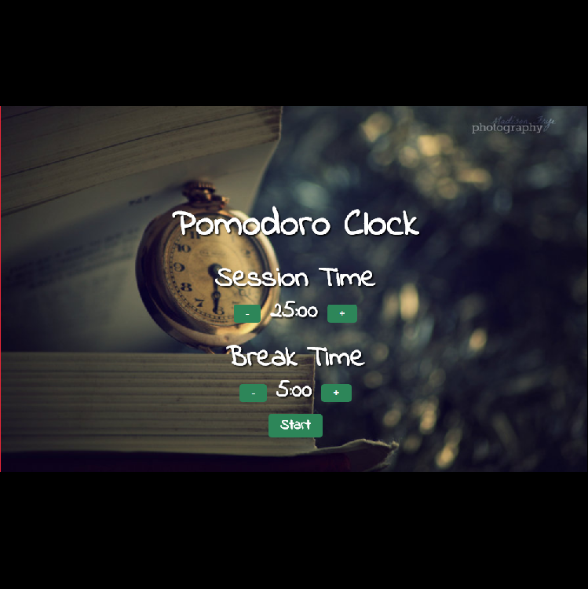

# PomodoroClock

### Overview
This assignments creates a simple pomodoro timer with customizable session and break lengths.

### Instructions
1. Users can start a 25 minute pomodoro, and the timer will go off once 25 minutes has elapsed.

2. Users can reset the clock for my next pomodoro.

3. Users can customize the length of each pomodoro.

### Technologies Used
- HTML
- CSS
- JavaScript

### **[Demo](https://munmuney.github.io/PomodoroClock)**